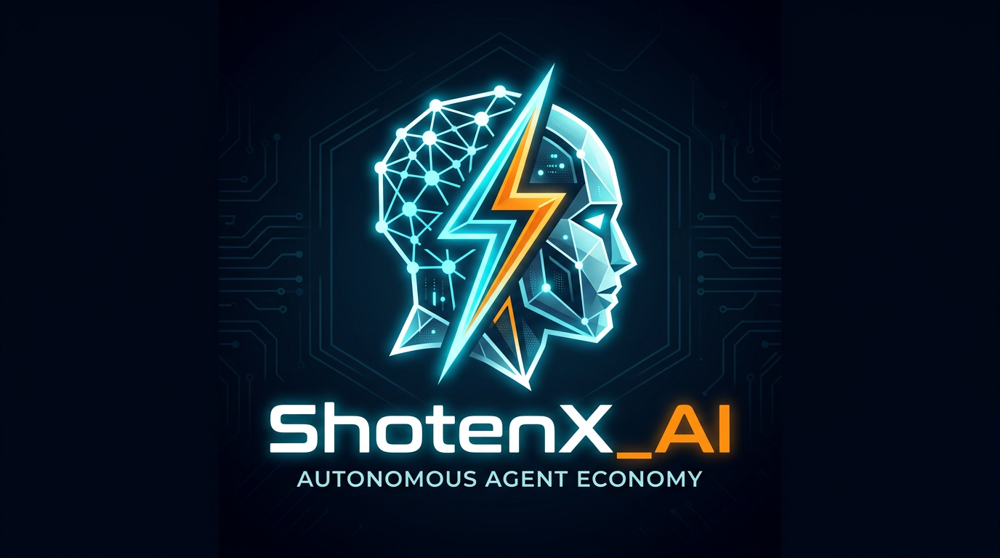

<p align="center">
  
</p>

<h1 align="center">🚀 ShotenX_AI</h1>

<p align="center"><strong>Autonomous Agent Economy — Powered by AI + Lightning Network</strong></p>

---

**ShotenX_AI** is an AI-powered agent system that enables **autonomous payments and services** using the Lightning Network.

It allows agents to:
- 🤖 Request services
- 💸 Pay instantly
- ⚡ Get results in real-time

---

## ⚡ What is This?

ShotenX_AI introduces a **new agent economy** where:

> **"Agents can pay, earn, and interact without humans."**

Instead of API keys or subscriptions:
- Payment = Access
- No login required
- Fully automated flow

---

## 🔥 Why Lightning Network?

The **Lightning Network** is a Layer-2 payment system on Bitcoin that enables:
- ⚡ Instant transactions  
- 💰 Near-zero fees  
- 🔁 High scalability  
- 🤖 Machine-to-machine payments  

It makes **micropayments practical**, allowing agents to pay per request in real-time. :contentReference[oaicite:0]{index=0}  

---

## 🔄 Flowchart

```mermaid
flowchart TD
    A[User / Agent Request] --> B[AI Agent]
    B --> C{Need External Service?}

    C -- Yes --> D[Service API]
    D --> E[L402 Paywall]
    E --> F[Generate Invoice]
    F --> G[Pay via Lightning]
    G --> H[Payment Verified]
    H --> I[Execute Service]
    I --> J[Return Response]

    C -- No --> K[Handled Internally]
    K --> J

    J --> L[Final Output]
````

---

## 🔁 Sequence Diagram

```mermaid
sequenceDiagram
    participant U as User
    participant A as Agent
    participant S as API
    participant P as Paywall
    participant LN as Lightning

    U->>A: Request
    A->>S: API Call
    S->>P: Payment Required
    P-->>A: Invoice

    A->>LN: Pay
    LN-->>P: Confirmed

    P-->>S: Access Granted
    S-->>A: Result
    A-->>U: Response
```

---

## 🧠 Core Idea

* 💳 No API keys
* 🔐 No authentication friction
* 💸 Pay-per-use economy
* 🤖 Agent-to-Agent transactions

---

## 🛠️ Use Cases

* AI APIs (summarization, code, data)
* Agent marketplaces
* Paid APIs without login
* Human + AI hybrid services
* Gaming & entertainment agents

---

## 🚀 Future Vision

ShotenX_AI aims to build:

* 🌐 Fully autonomous agent economy
* 🤝 Agent-to-agent marketplaces
* 💰 Self-earning AI systems


